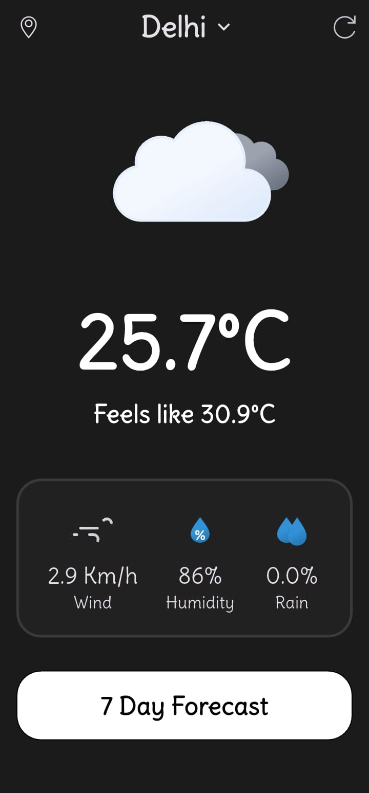
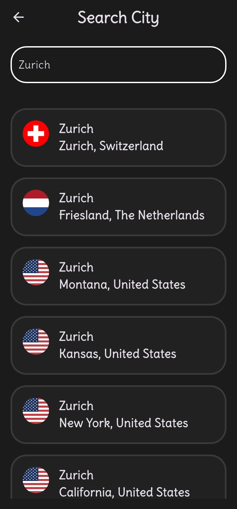
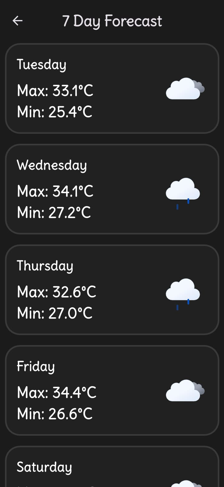

<p align="center">

</p>
<h1 align="center">
Material Weather 
</h1>

<br />

<div align="center">


<br/>


</div>
<br />

**A modern, material design-inspired weather application built with Flutter.**

This application provides real-time weather information with a clean, intuitive, and user-friendly interface. It's designed to be simple, fast, and elegant, offering essential weather data at a glance.

## ✨ Features

  * **Real-time Weather Data:** Get up-to-the-minute weather conditions for your current location or any city worldwide.
  * **Detailed Forecasts:** Access daily weather forecasts to plan your week ahead.
  * **Location-Based Services:** Automatically detects your current location to provide accurate local weather.
  * **City Search:** Manually search for and save multiple locations to easily switch between them.
  * **Sleek, Material Design UI:** Aesthetically pleasing and intuitive user interface, following Google's Material Design guidelines.
  * **Lightweight and Fast:** Optimized for performance to ensure a smooth and responsive user experience.

## 🖼️ Screenshots

<!--    -->
<p float="left">


</p>

## 🛠️ Tech Stack

This project is built using the following technologies and languages:

  * **[Flutter](https://flutter.dev/):** The core framework for building the application from a single codebase.
  * **[Dart](https://dart.dev/):** The programming language used for Flutter development.

Dependencies are managed using `pubspec.yaml`.

## 🚀 Getting Started

To get a local copy up and running, please follow these simple steps.

### Prerequisites

  * [Flutter SDK](https://flutter.dev/docs/get-started/install)
  * [Android Studio](https://developer.android.com/studio) or [Visual Studio Code](https://code.visualstudio.com/)

### Installation

1.  **Clone the repository:**

    ```sh
    git clone https://github.com/Abhik555/material-weather.git
    ```

2.  **Navigate to the project directory:**

    ```sh
    cd material-weather
    ```

3.  **Install dependencies:**

    ```sh
    flutter pub get
    ```

4.  **Run the application:**

    ```sh
    flutter run
    ```
## 🙌 Contributing

Contributions are what make the open-source community such an amazing place to learn, inspire, and create. Any contributions you make are **greatly appreciated**.

If you have a suggestion that would make this better, please fork the repo and create a pull request. You can also simply open an issue with the tag "enhancement".

1.  Fork the Project
2.  Create your Feature Branch (`git checkout -b feature/AmazingFeature`)
3.  Commit your Changes (`git commit -m 'Add some AmazingFeature'`)
4.  Push to the Branch (`git push origin feature/AmazingFeature`)
5.  Open a Pull Request

## 📄 License

This project is licensed under the MIT License. See the `LICENSE` file for more information.

## 📧 Contact

[Abthedev](https://www.linkedin.com/in/abthedev/)